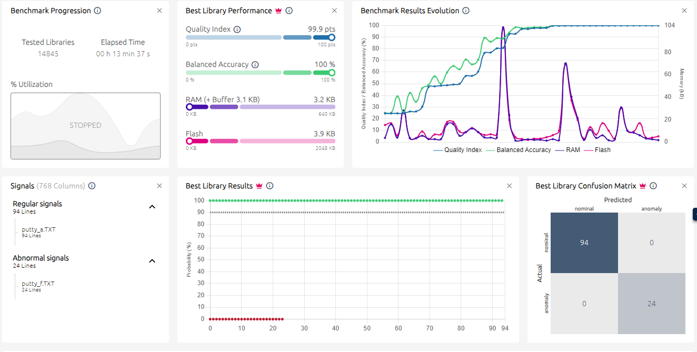
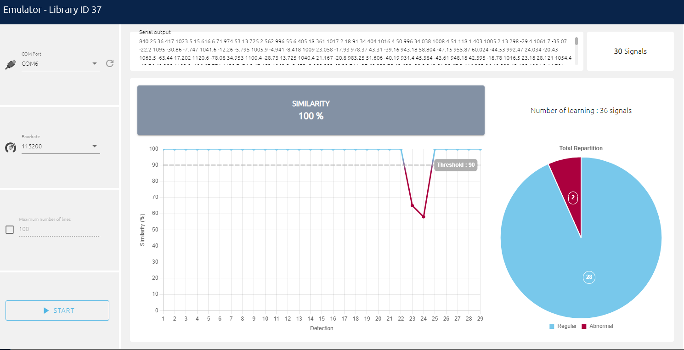
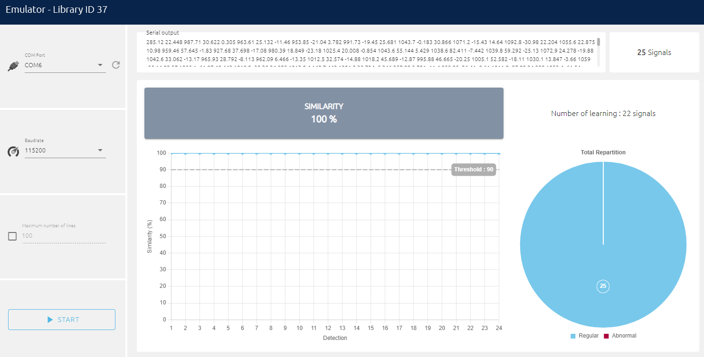

# Rapport d'Expérience - Détection d'Anomalies par Intelligence Artificielle Embarquée

## Introduction

Cette expérience nous a permis d'explorer l'implémentation d'une solution d'intelligence artificielle embarquée pour la détection d'anomalies vibratoires sur systèmes mécaniques. L'objectif principal était de développer un système capable d'identifier automatiquement les dysfonctionnements d'un ventilateur en analysant ses vibrations à l'aide d'un accéléromètre intégré sur une plateforme STM32, en utilisant la technologie NanoEdge AI Studio de STMicroelectronics.

## Partie 1 : Analyse de la Chaîne d'Instrumentation

Avant de commencer l'expérimentation proprement dite, nous avons procédé à une analyse approfondie du code source du projet. Cette phase d'analyse nous a permis de comprendre l'architecture complète du système de mesure et de traitement.

La chaîne d'instrumentation se compose d'une série d'éléments interconnectés qui transforment progressivement les vibrations mécaniques en données exploitables. Les vibrations générées par le moteur sont d'abord captées par le capteur ISM330DHCX, un module inertiel 6 axes fabriqué par STMicroelectronics qui intègre à la fois un accéléromètre et un gyroscope. Ce capteur transforme les mouvements physiques en signaux électriques grâce à ses structures MEMS internes, puis numérise ces signaux via son convertisseur analogique-numérique intégré.

La communication entre le capteur et le microcontrôleur STM32L4R9 s'effectue via le bus SPI3, comme nous pouvons le voir dans la définition `SENSOR_BUS hspi3` au début du fichier main.c (ligne 40). Le protocole SPI a été choisi pour sa vitesse de transmission élevée, essentielle lorsqu'on travaille avec une fréquence d'échantillonnage importante. Les fonctions `platform_write` et `platform_read` implémentées dans le code (lignes 750-779) gèrent les transactions SPI en contrôlant le signal de chip select CS_DHC, garantissant ainsi une communication fiable avec le capteur.

Le paramétrage du capteur révèle des choix techniques importants. La fréquence d'échantillonnage a été configurée à 833 Hz via l'instruction `ism330dhcx_xl_data_rate_set(&dev_ctx, ISM330DHCX_XL_ODR_833Hz)` (ligne 156). Cette valeur n'a pas été choisie au hasard : elle respecte largement le théorème de Shannon-Nyquist qui exige une fréquence d'échantillonnage au moins deux fois supérieure à la fréquence maximale du signal à analyser. Pour notre application avec des vitesses de rotation allant jusqu'à 1500 tours par minute (soit 25 Hz), et en considérant les harmoniques qui peuvent atteindre plusieurs centaines de Hertz dans les vibrations mécaniques, 833 Hz offre une marge confortable pour capturer toutes les composantes fréquentielles pertinentes.

La plage de mesure a été fixée à ±2g (ligne 158), ce qui correspond à environ ±19.6 m/s². Cette sensibilité relativement fine est bien adaptée aux vibrations d'un ventilateur qui génère typiquement des accélérations comprises entre 0.1g et 1g. Un choix plus large comme ±8g ou ±16g aurait certes permis de mesurer des chocs plus importants, mais au prix d'une résolution quatre à huit fois inférieure, rendant la détection de variations subtiles beaucoup plus difficile. La conversion des valeurs brutes en milligrammes s'effectue via la fonction `ism330dhcx_from_fs2g_to_mg`, qui adapte automatiquement l'échelle de conversion à la plage sélectionnée.

Le système collecte 256 échantillons pour chacun des trois axes (X, Y, Z) comme défini par `DATA_INPUT_USER 256` dans NanoEdgeAI.h (ligne 36), ce qui représente une fenêtre temporelle d'environ 307 millisecondes à 833 Hz. Cette durée de capture permet de saisir plusieurs cycles complets de rotation même à basse vitesse, fournissant ainsi suffisamment d'informations pour que l'algorithme d'apprentissage automatique puisse extraire des caractéristiques pertinentes.

Une question légitime serait : que se passerait-il si nous réduisions drastiquement la fréquence d'échantillonnage ? Pour répondre à cette interrogation, une expérience complémentaire pourrait consister à reconfigurer le système à 16 Hz (ou plus précisément 12.5 Hz, la valeur standard la plus proche disponible sur l'ISM330DHCX). À cette fréquence, non seulement nous violerions le critère de Nyquist pour les harmoniques, mais même la fréquence fondamentale de rotation à vitesse maximale (25 Hz) serait mal échantillonnée. Le phénomène de repliement spectral (aliasing) transformerait alors les hautes fréquences en fausses basses fréquences, créant des artéfacts dans les données. Les performances de détection d'anomalies chuteraient considérablement, car l'intelligence artificielle ne disposerait plus des informations spectrales nécessaires pour distinguer un fonctionnement normal d'un fonctionnement anormal. Cette expérience démontrerait de manière concrète l'importance cruciale du respect des principes fondamentaux du traitement du signal.

## Partie 2 : Collecte des Données et Entraînement du Modèle

La phase de collecte de données constitue le fondement de tout système d'apprentissage automatique. Nous avons adopté une approche méthodique en deux temps pour constituer notre base d'apprentissage. Dans un premier temps, nous avons enregistré des séries complètes de mesures avec le ventilateur fonctionnant normalement aux trois vitesses de rotation : basse (Low), moyenne (Medium) et haute (High). Ces enregistrements ont été effectués avec le système parfaitement équilibré, sans obstruction ni perturbation mécanique. Cette phase a généré notre dataset de référence représentant le comportement nominal du système.

*Figure 1 : Collecte des données en conditions normales de fonctionnement*

*Figure 2 : Analyse détaillée des signaux d'accélération en fonctionnement nominal*

Dans un second temps, nous avons volontairement introduit des anomalies pour créer notre dataset de défauts. Ces anomalies comprenaient des déséquilibres du rotor, des blocages partiels, ou d'autres perturbations mécaniques simulant des dysfonctionnements réels. Cette approche binaire - données normales versus données anormales - permet au modèle d'apprentissage de construire une frontière de décision claire entre les deux états.

Une fois les données collectées, nous les avons importées dans NanoEdge AI Studio, la plateforme de développement d'IA embarquée de STMicroelectronics. Nous avons sélectionné le mode "Anomaly Detection" qui est particulièrement adapté à notre cas d'usage : le système apprend ce qu'est un comportement normal et détecte ensuite tout écart par rapport à cette norme. L'avantage de cette approche est qu'elle ne nécessite pas de caractériser exhaustivement tous les types de pannes possibles ; il suffit de bien définir l'état sain du système.

Le studio a automatiquement analysé la qualité des signaux et nous a suggéré de retirer certains échantillons jugés incohérents ou bruités. Après ce nettoyage, nous avons lancé le processus d'entraînement qui a testé différentes architectures de réseaux de neurones et configurations d'hyperparamètres. L'outil optimise automatiquement le modèle pour trouver le meilleur compromis entre performance de détection et contraintes d'embarqué.

Les résultats de l'entraînement se sont révélés très satisfaisants. Le modèle généré occupe moins de 4 Ko de mémoire Flash pour le code et moins de 4 Ko de RAM pour l'exécution, ce qui est remarquablement compact. Cette faible empreinte mémoire rend le modèle compatible avec même les microcontrôleurs les plus modestes, tout en laissant suffisamment de ressources pour le reste de l'application. La bibliothèque générée inclut trois fonctions principales : `neai_anomalydetection_init()` pour l'initialisation, `neai_anomalydetection_learn()` pour la phase d'apprentissage in-situ, et `neai_anomalydetection_detect()` pour l'inférence en temps réel.

## Partie 3 : Validation et Résultats Expérimentaux

La phase d'émulation dans NanoEdge AI Studio nous a permis de tester le modèle avant son déploiement sur la cible physique. Cette étape s'est avérée particulièrement instructive pour comprendre le comportement du système d'anomaly detection.

Lorsque nous avons effectué la phase de learning avec uniquement des données parfaitement normales, puis testé le modèle en detection avec un mélange de données normales et anormales, les résultats ont été excellents. Le système attribuait des scores de similarité élevés (proches de 100%) aux signaux normaux et des scores faibles (en dessous du seuil de 90 défini dans le code) aux signaux anormaux. La distinction était nette et les faux positifs quasiment absents.

*Figure 3 : Résultats de détection après apprentissage sur données normales pures*

Cependant, nous avons également mené une expérience révélatrice : utiliser des données contenant déjà des perturbations pendant la phase de learning. Dans ce scénario, le modèle "apprenait" que ces perturbations faisaient partie du fonctionnement normal. Lors de la phase de detection ultérieure, le système ne parvenait alors à détecter que les anomalies significativement différentes de celles présentes dans le dataset d'apprentissage. Les défauts similaires à ceux vus pendant l'entraînement étaient considérés comme normaux. Cette observation souligne un principe fondamental de l'apprentissage automatique : la qualité et la représentativité des données d'entraînement sont absolument cruciales.

*Figure 4 : Impact de données d'apprentissage contaminées sur la performance de détection*

Après validation en émulation, nous avons procédé au déploiement sur la carte STWIN.KT1B. Le code généré par NanoEdge AI s'est intégré parfaitement dans notre projet STM32CubeIDE. La constante `NEAI_MODE` (ligne 42 de main.c) permet de basculer entre le mode datalogging (0) pour la collecte de données brutes et le mode AI (1) pour l'exécution du détecteur d'anomalies.

En mode AI, le système fonctionne selon deux phases. D'abord, une phase de learning où le microcontrôleur acquiert 50 signaux du ventilateur en fonctionnement réel (défini par `LEARN_NB 50` ligne 41). Cette calibration in-situ permet au modèle de s'adapter aux conditions spécifiques de l'installation : température ambiante, fixation mécanique, tolérances de fabrication. Pendant cette phase, la LED2 reste allumée pour indiquer que le système est en apprentissage.

Une fois l'apprentissage terminé, le système passe automatiquement en mode detection. Il acquiert continuellement des fenêtres de 256 échantillons, les soumet à l'algorithme de détection qui retourne un score de similarité entre 0 et 100. Pour améliorer la robustesse, le code calcule une moyenne sur trois inférences consécutives (paramètre `NEAI_NB_VERIFS 3` ligne 43) avant de prendre une décision. Si le score moyen dépasse 90, la LED verte s'allume indiquant un fonctionnement normal ; sinon, la LED orange s'active pour signaler une anomalie.

Lors de nos tests sur le banc expérimental, le système a démontré une excellente fiabilité. Le ventilateur tournant normalement aux trois vitesses était systématiquement reconnu comme sain. Dès que nous introduisions une perturbation mécanique - même subtile comme un léger déséquilibre ou une légère obstruction - le score de similarité chutait rapidement sous le seuil et l'alerte se déclenchait. Le temps de réponse était quasi instantané, de l'ordre de quelques secondes, incluant l'acquisition des données et le traitement par le réseau de neurones.

## Conclusion

Cette expérience nous a permis de maîtriser la chaîne complète de développement d'un système de maintenance prédictive basé sur l'intelligence artificielle embarquée, depuis la compréhension de l'instrumentation jusqu'au déploiement d'un modèle opérationnel sur microcontrôleur.
