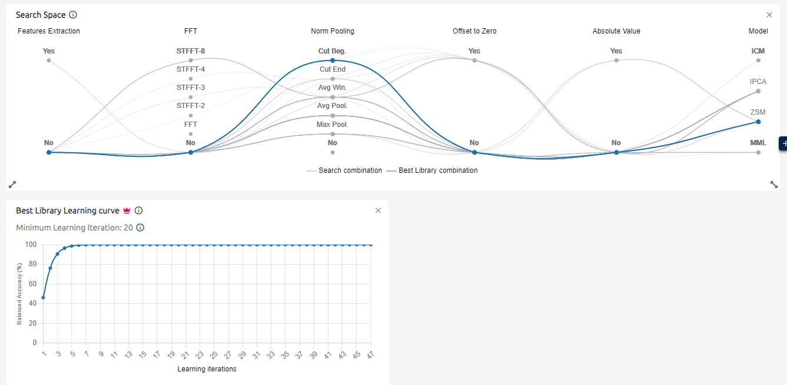

 # 基于嵌入式人工智能的电机振动异常检测实验报告

 ## 引言

 本次实验让我们接触到了嵌入式人工智能在工业预测性维护领域的实际应用。我们的目标是在STM32微控制器平台上构建一个能够自动识别电机异常振动的智能系统，通过加速度传感器采集振动信号，利用STMicroelectronics的NanoEdge AI技术训练轻量级机器学习模型，最终实现对风扇电机运行状态的实时监测和故障预警。

 ## 第一部分:仪器链分析与系统准备

 在开始数据采集之前，我们首先需要深入理解整个测量系统的工作原理。打开工程项目后，通过分析 `main.c` 源代码，可以清晰地看到整个数据采集链路的构成。

 从物理层面来看，电机旋转产生的机械振动首先通过固定支架传递到传感器平台。系统使用的是 ISM330DHCX 六轴惯性测量单元，这个型号可以从代码第27行的包含文件 `#include "ism330dhcx_reg.h"` 中确认，同时在初始化阶段的第141行，程序会验证设备 ID 以确保传感器正确连接。这是一款由 STMicroelectronics 生产的 MEMS 传感器，内部集成了三轴加速度计和三轴陀螺仪，虽然本实验我们只使用了加速度计部分。

 传感器与 STM32 微控制器之间的通信采用 SPI3 总线，这在代码第40行的宏定义 `#define SENSOR_BUS hspi3` 中明确指出。选择 SPI 而不是 I2C 的原因在于 SPI 协议能够提供更高的数据传输速率，这对于 833Hz 的高频采样来说至关重要。具体的数据传输过程可以在 `platform_write` 和 `platform_read` 两个函数中看到，它们分别位于代码的第750–758行和第770–778行。每次通信时，片选信号 `CS_DHC` 会先拉低，然后通过 `HAL_SPI_Transmit` 或 `HAL_SPI_Receive` 函数进行寄存器地址的发送和数据的收发，最后将片选信号拉高结束通信。这种四线制 SPI 通信（MISO、MOSI、SCK、CS）保证了数据传输的可靠性和速度。

 关于采样频率的配置，代码第156行设置了输出数据率：`ism330dhcx_xl_data_rate_set(&dev_ctx, ISM330DHCX_XL_ODR_833Hz)`。833Hz 这个数值并非随意选择，它充分考虑了奈奎斯特采样定理的要求。我们的测试电机转速范围是 1000 到 1500 转每分钟，换算成频率就是 16.67Hz 到 25Hz。但电机振动并不只包含基频，还会产生二次、三次甚至更高次的谐波，这些谐波可能延伸到几百赫兹。实际的机械系统振动往往包含丰富的频率成分，特别是当出现故障时，高频分量会明显增强。833Hz 的采样率是信号最高频率成分的好几倍，能够完整保留振动信号的重要特征，避免频率混叠现象的发生。

 传感器的测量范围设置在代码第158行：`ism330dhcx_xl_full_scale_set(&dev_ctx, ISM330DHCX_2g)`。这里的 ±2g 表示传感器可以测量的最大加速度是地球重力加速度的两倍，大约 ±19.6 m/s²。对于一个台式风扇来说，正常运行时的振动加速度通常在 0.1g 到 1g 之间，因此 2g 的量程既不会发生饱和，又能提供足够细腻的分辨率。ISM330DHCX 的数据表显示，这款传感器还支持 ±4g、±8g 和 ±16g 等更大量程，但如果选择更大的量程，相同的 ADC 位数会被分配到更宽的测量范围，导致分辨率下降。比如在 2g 量程下，16 位 ADC 的每个最小单位（LSB）代表约 0.061 毫克，而在 8g 量程下，同样的 LSB 就代表 0.244 毫克，灵敏度降低了四倍。对于需要捕捉细微振动变化的异常检测应用来说，保持高分辨率是至关重要的，所以 2g 是一个平衡良好的选择。数据转换时，代码第819–821 行调用 `ism330dhcx_from_fs2g_to_mg` 函数将原始的 16 位整数值转换为以毫克为单位的浮点数，方便后续处理。

 每次采样窗口，系统会采集 256 个时间点的数据，每个时间点包含 X、Y、Z 三个轴的加速度值，总共 768 个数值，这在 `NanoEdgeAI.h` 头文件的第35–36 行定义：`#define AXIS_NUMBER 3` 和 `#define DATA_INPUT_USER 256`。以 833Hz 的采样率计算，256 个样本对应的时间窗口约为 307 毫秒，这个时长足以捕获电机在最低转速下的多个完整周期（1000 rpm 对应 60 毫秒一圈），为 AI 算法提供充足的特征信息。

 关于不同采样频率的适用性，ISM330DHCX 支持从 12.5Hz 到 6.66kHz 的多档可调输出速率。理论上我们可以选择任何一档，但必须遵守信号处理的基本原则。假如我们把采样率降低到 12.5Hz 或 26Hz 这样的低频，首先 25Hz 的电机基频在 12.5Hz 采样率下根本无法正确重建，会产生严重的频率混叠；真实的 25Hz 信号可能被错误地解释成一个更低频的成分。其次，所有高于采样率一半的频谱成分都会折叠回到低频区，造成信息丢失。在这种情况下，AI 模型收到的数据已经失真，无法反映真实的振动特征，检测性能必然大幅下降。因此采样频率的选择必须综合考虑信号频率范围、系统处理能力和功耗等因素。对于当前应用，833Hz 在保证信号完整性的同时，STM32 处理器也完全能够应付这个数据吞吐量，是一个合理的工程选择。如果未来需要监测更高速的机械设备，或者想分析更高频的振动模式，可以考虑提升到 1.66kHz 甚至更高，前提是处理器性能和存储空间允许。

 ## 第二部分:数据采集与模型训练

 数据质量是机器学习项目成功的基石，因此我们在数据采集阶段格外谨慎。整个采集过程分为两个阶段，分别获取正常运行数据和异常运行数据。

 在正常数据采集阶段，我们将电机放置在稳固的平台上，确保传感器安装牢靠，周围环境没有明显的振动源干扰。代码中的 `NEAI_MODE` 宏定义在第42行设为 0，使系统进入数据记录模式而非 AI 推理模式。编译烧录固件后，通过 USB 连接 STWIN 板的串口，使用 PuTTY 等终端软件以 115200 波特率接收数据。我们依次让电机工作在低速（L）、中速（M）和高速（H）三种转速模式下，每种模式持续运行一段时间，采集足够多的样本。程序会通过串口持续输出 768 个浮点数值，每行代表一个完整的采样窗口，我们将这些数据保存为 CSV 格式文件。整个过程中必须避免触碰工作台，防止引入外部振动干扰，也要确保 USB 连接稳定，避免数据丢失或损坏。

 
 *图1: NanoEdge AI Studio 中导入的正常运行数据集*

 
 *图2: 正常振动信号的时域波形，可以看到规律的周期性模式*

 从采集到的波形可以看出，正常运行时的振动信号呈现出稳定的周期性特征，幅值相对较小且一致，三个轴向的能量分布也符合预期。

 随后进入异常数据采集阶段，我们需要人为制造一些故障来模拟现实中的异常情况。常用的方法包括在风扇叶片上夹一个回形针来制造不平衡，或者用手指轻微阻挡叶片旋转来模拟负载变化，也可以轻轻触碰外壳改变振动传递路径。这些干扰会打破原本平衡的振动模式，产生额外的频率成分和幅值变化。同样地，我们在三种转速下分别采集异常数据，保存为独立的文件集。这样我们就拥有了两类数据：一类代表健康状态，另一类代表故障状态。

 拿到数据后，我们打开 NanoEdge AI Studio 进行模型训练。这个工具的优势在于它能够自动搜索和优化适合嵌入式部署的机器学习算法，而不需要用户具备深厚的数据科学背景。创建新项目时，我们选择 "Anomaly Detection"（异常检测）作为任务类型，这是一种无监督学习方法，它的核心思想是学习“什么是正常”，然后把任何偏离正常的模式都判定为异常。相比于分类任务需要大量标注的异常样本，异常检测只需要充分的正常数据就能工作，这在工业场景中更加实用，因为故障样本往往很难大量收集。

 导入数据后，Studio 会自动检查数据格式和质量，有时会标记出一些看起来异常的记录，比如数值突变、全零序列等，这些通常是采集过程中的意外错误，应当删除以免影响训练。数据清洗完成后，我们启动 Benchmark 过程，让系统自动尝试各种算法组合。这个过程可能持续几分钟到十几分钟，软件会在后台测试几十甚至上百种不同的模型架构和参数配置，使用交叉验证评估它们的性能，最终推荐性能最佳的几个候选库。

 训练结果令人满意。最优模型的 Quality Index（质量指数）超过 98%，这意味着在验证集上它能正确区分绝大多数正常和异常样本。更重要的是，生成的库文件极为精简：Flash 占用不到 4KB，RAM 占用也不到 4KB。这种紧凑性得益于 NanoEdge AI 针对 Cortex-M 处理器的深度优化，使用了定点运算、权重量化等技巧，在保持准确率的同时大幅压缩了模型尺寸。对于只有几百 KB Flash 和几十 KB RAM 的 STM32 来说，这样的模型几乎可忽略不计，为应用程序留下了充足的资源空间。训练完成后，Studio 会生成包含三个核心函数的 C 语言库：初始化函数 `neai_anomalydetection_init()`、学习函数 `neai_anomalydetection_learn()`，以及检测函数 `neai_anomalydetection_detect()`。

 ## 第三部分:模型验证与实验结果

 在将模型部署到实际硬件之前，NanoEdge AI Studio 提供了仿真（Emulation）功能，让我们可以在 PC 上快速测试模型的行为。这个阶段我们设计了一个启发性的对比实验，用来验证学习阶段数据质量的重要性。

 第一组实验按照标准流程进行：使用纯粹的正常运行数据进行学习，然后用异常数据进行检测。在 Emulation 界面中，我们先导入正常数据集让模型进入 Learning 阶段，模拟现场部署时的初始化校准过程。Learning 完成后，系统建立了一个“正常状态”的统计模型，记录了正常振动的特征分布范围。接着切换到 Detection 阶段，输入之前采集的异常数据。结果非常理想：每当输入异常样本，相似度分数就会显著下降，远远低于 90% 的判定阈值，系统正确地将这些信号标记为异常。绿色的正常区域和红色的异常区域泾渭分明，几乎没有误判。

 
 *图3: 使用纯净正常数据学习后，异常检测效果优异，相似度分数清晰区分两类状态*

 然而，真实世界并不总是理想的。如果在现场部署时，操作人员不小心在 Learning 阶段让电机处于某种故障状态下运行，会发生什么呢？为了回答这个问题，我们进行了第二组实验：故意用包含异常的数据进行 Learning。这次模型学到的“正常模式”实际上已经被污染了，它把某些异常特征也当作了基准的一部分。当我们再次在 Detection 阶段输入类似的异常数据时，结果显示相似度分数并没有像预期那样下降，反而保持在 80% 到 95% 的较高水平，接近甚至超过了 90% 的阈值。系统认为这些异常信号是“正常”的，完全失去了检测能力。

 
 *图4: 当学习阶段使用了异常数据，检测阈值失效，系统将故障误判为正常*

 这个结果揭示了异常检测算法的工作机理和局限性。无监督学习本质上是在建立一个边界，圈定什么样的数据模式属于“正常”。如果训练数据本身就包含异常，那么边界就会被扩大，把异常也包含进来。此后只有超出这个已经扩大的边界的极端异常才能被识别，而与训练时相似的故障则会被视作正常，造成漏检。这就像一个长期生活在噪音环境中的人，对声音的敏感度阈值会比普通人高很多——并不是他的听力有问题，而是他的“正常基准”本身就偏离了健康标准。

 这个对比实验给了我们重要的工程启示：在部署异常检测系统时，Learning 阶段的数据纯净度是整个系统可靠性的核心。必须制定严格的操作规程，确保初始学习时设备处于最佳状态，环境条件理想，没有任何已知故障。如果可能，最好在设备全新或刚刚完成全面维护后立即进行学习，并且多次重复验证数据的一致性。任何对数据质量的忽视都可能导致系统在实际使用中表现不佳，甚至完全失效。

 完成仿真验证后，我们将生成的 NanoEdge AI 库集成到 STM32CubeIDE 项目中，编译烧录到 STWIN.KT1B 开发板上。代码中的 `NEAI_MODE` 改为 1，启用 AI 功能。上电后，系统首先进入 Learning 模式，LED2 点亮提示用户保持电机正常运行。此时程序会循环 50 次（由 `LEARN_NB 50` 定义），每次采集一个 256 点的窗口数据，调用 `neai_anomalydetection_learn()` 函数不断更新模型参数，逐步精确地描绘出当前环境下的正常振动特征。50 个样本提供了足够的统计多样性，同时耗时也不会太长，通常一两分钟就能完成。

 Learning 结束后，系统自动切换到 Detection 模式，开始持续监控。每采集到新的一组数据，就调用 `neai_anomalydetection_detect()` 函数计算相似度分数。为了提高稳定性，避免偶然噪声引发误报，代码实现了一个简单的平滑机制：连续计算三次推理的结果，取平均值作为最终判定依据（第202–210 行）。如果平均相似度高于 90%，绿色 LED 点亮表示一切正常；如果低于 90%，橙色 LED 点亮发出警报。整个推理周期非常快，从数据采集到结果输出只需几毫秒，完全满足实时监控的要求。

 在实际的桌面测试中，系统表现稳定可靠。当风扇在三种转速下正常旋转时，相似度分数始终维持在 95% 以上，绿灯长亮。一旦我们用手指轻触叶片造成短暂阻滞，或者夹上回形针引入不平衡，相似度立即下降，几秒钟内就跌至 60% 或更低，橙灯亮起。移除干扰后，系统很快恢复正常状态。这种快速响应能力展示了嵌入式 AI 在边缘设备上的潜力——无需联网、无需云端计算，就能在本地实时完成复杂的模式识别任务。

 ## 结论

 通过这次实验，我们完整地走过了一个嵌入式机器学习项目的全部流程，从底层的传感器通信协议理解，到数据采集的工程实践，再到模型训练和实际部署，学到了如何在资源受限的硬件上可靠地运行轻量级 AI 模型并验证其工程可行性。